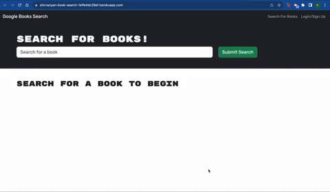
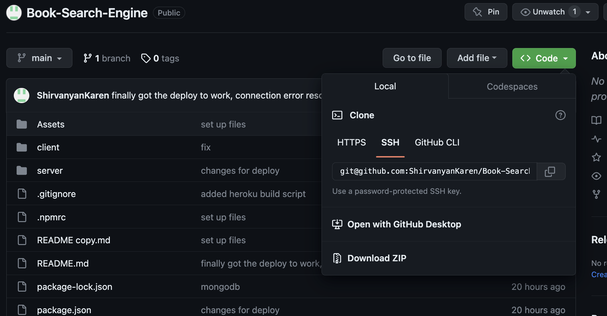

# Book-Search-Engine

## Technology used
| Technology Used and Deployed App       | Resource URL           | 
| ------------- |:-------------:| 
| Deployed Application | [https://shirvanyan-book-search-1effe4dc29af.herokuapp.com/ ](https://shirvanyan-book-search-1effe4dc29af.herokuapp.com/ ) |
| My Repository | [https://github.com/ShirvanyanKaren/Book-Search-Engine](https://github.com/ShirvanyanKaren/Book-Search-Engine) |
| Vite | [https://vitejs.dev/](https://vitejs.dev/) |
| React | [https://developer.chrome.com/docs/workbox/#injectmanifest_plugin](https://developer.chrome.com/docs/workbox/#injectmanifest_plugin) |
| MongoDB | [https://www.mongodb.com/docs/](https://www.mongodb.com/docs/) |
| Express | [https://expressjs.com/](https://expressjs.com/) |
| Apollo | [https://www.apollographql.com/docs/](https://www.apollographql.com/docs/) |
| Git | [https://git-scm.com/](https://git-scm.com/)     | 


# Description

This application served as an introduction to the MERN stack, with the objective being to replace the RESTful routes in the source code with GraphQL queries and mutations to modify data. The app enables users to create an account, search for books, and save books under their account. 


The application had to meet the following acceptance criteria:

```md
GIVEN a book search engine
WHEN I load the search engine
THEN I am presented with a menu with the options Search for Books and Login/Signup and an input field to search for books and a submit button
WHEN I click on the Search for Books menu option
THEN I am presented with an input field to search for books and a submit button
WHEN I am not logged in and enter a search term in the input field and click the submit button
THEN I am presented with several search results, each featuring a book’s title, author, description, image, and a link to that book on the Google Books site
WHEN I click on the Login/Signup menu option
THEN a modal appears on the screen with a toggle between the option to log in or sign up
WHEN the toggle is set to Signup
THEN I am presented with three inputs for a username, an email address, and a password, and a signup button
WHEN the toggle is set to Login
THEN I am presented with two inputs for an email address and a password and login button
WHEN I enter a valid email address and create a password and click on the signup button
THEN my user account is created and I am logged in to the site
WHEN I enter my account’s email address and password and click on the login button
THEN I the modal closes and I am logged in to the site
WHEN I am logged in to the site
THEN the menu options change to Search for Books, an option to see my saved books, and Logout
WHEN I am logged in and enter a search term in the input field and click the submit button
THEN I am presented with several search results, each featuring a book’s title, author, description, image, and a link to that book on the Google Books site and a button to save a book to my account
WHEN I click on the Save button on a book
THEN that book’s information is saved to my account
WHEN I click on the option to see my saved books
THEN I am presented with all of the books I have saved to my account, each featuring the book’s title, author, description, image, and a link to that book on the Google Books site and a button to remove a book from my account
WHEN I click on the Remove button on a book
THEN that book is deleted from my saved books list
WHEN I click on the Logout button
THEN I am logged out of the site and presented with a menu with the options Search for Books and Login/Signup and an input field to search for books and a submit button  
```


Here is an example of how the application runs:




## Table of Contents
* [MongoDB](#mongodb)
* [Express](#vite)
* [React](#react)
* [Apollo](#apollo)
* [Installation](#installation)
* [Usage](#usage)
* [License](#license)
* [Questions](#questions) 

## MongoDB
MongoDB is a noSQL database program that was integrated in this project with the use of the mongoose package. The program incorporates schemas similar to JSON structure that describe the characteristics of the data we store. 

The following is an example of a book schema used in this application. The schema stores values that describe the book and includes a bookId that can be used to access unique instances of a book. 

```js
const { Schema } = require('mongoose');


const bookSchema = new Schema({
  authors: [
    {
      type: String,
    },
  ],
  description: {
    type: String,
    required: true,
  },
 
  bookId: {
    type: String,
    required: true,
  },
  image: {
    type: String,
  },
  link: {
    type: String,
  },
  title: {
    type: String,
    required: true,
  },
});

module.exports = bookSchema;
```

## Express
Express is a back-end web application framework for building APIs. Express was utilized in the server file for this project for middleware and providing routes to back-end data. Rather than using RESTful routes, this project incorporated queries and mutations native to apollo to perform CRUD operations. 
```js
const startApolloServer = async () => {
  await server.start();
 
  app.use(express.urlencoded({ extended: true }));
  app.use(express.json());

  app.use('/graphql', expressMiddleware( server, {
    context: authMiddleware
  }));

  if (process.env.NODE_ENV === 'production') {
    app.use(express.static(path.join(__dirname, '../client/dist')));

    app.get('*', (req,res) => {
      res.sendFile(path.join(__dirname, '../client/dist/index.html'));
    }
    );
  }

  db.once('open', () => {
    app.listen(PORT, () => {
    console.log(`🌍 Now listening on localhost:${PORT}`);
    console.log(`Use GraphQL at http://localhost:${PORT}/graphql`);
  });
  });

}

```

## Apollo 

Apollo is a comprehensive GraphQL client and server ecosystem that simplifies data management in web and mobile applications. It provides tools and libraries to seamlessly connect front-end applications with back-end data sources using GraphQL, making it easier to fetch, manage, and update data in a more efficient and organized manner. Apollo was utilized in this project through the creation of queries and mutations defined in the typeDefs file and utilized in the resolvers file. 


### TypeDefs
The typeDefs file essentialy includes a string literal of our schemas and their values and defines the types of operations we can perform i.e. mutations and queries.


```js
type Query {
    users: [User]
    user(username: String!): User
    me: User
    books(username: String): [Book]
    book(bookId: ID!): Book
}

type Mutation {
    addUser(username: String!, email: String!, password: String!): Auth
    login(email: String!, password: String!): Auth
    saveBook(input: inputBook!): User
    removeBook(bookId: ID!): User
}
```
### Resolvers 
The resolvers files are what enable us to perform CRUD operations by enabling these mutations and queries through defining the values they update, delete, create, or pull on our back-end
```js
const resolvers = {
    Query: {
        users : async (parent, { username }) => {
            return username.find({}).populate('savedBooks')
        },
        user: async (parent, { username }) => {
            return User.findOne({ username }).populate('savedBooks')
        },
        me: async (parent, args, context) => {
            if(context.user) {
                return User.findOne({ _id: context.user._id }).populate('savedBooks')
            }
            throw new AuthenticationError('You need to be logged in!')
        },

    },
    ...
 Mutation: {
        addUser: async (parent, { username, email, password }) => {
            const user = await User.create({ username, email, password })
            const token = signToken(user)
            return { token, user }
        },
        login: async (parent, {email, password }) => {
            const user = await User.findOne({ email })
            if (!user ) {
                throw new AuthenticationError('No user found with this email address')
            }
            const correctPw = await user.isCorrectPassword(password)
            if (!correctPw) {  
                throw new AuthenticationError('Incorrect password')
            }
            
            const token = signToken(user)
            return { token, user }
        }, 
        saveBook: async (parent, { input }, context) => {
            if (context.user) {
            const updatedUser = await User.findOneAndUpdate( 
                { 
                    _id: context.user._id 
                },
                { 
                    $addToSet: 
                    { savedBooks: input } 
                },
                { 
                    new: true, 
                    runValidators: true
                }
            )
            return updatedUser
        }
        throw new AuthenticationError('You need to be logged in!')

    },


}
}
```


## React

React is an open-source JavaScript library for building user interfaces, known for its component-based architecture and efficient rendering. It allows developers to create interactive and dynamic web applications by efficiently updating the user interface in response to changes in data. React was utilized in this application to render front-end components and pages and handle CRUD operations more effectively as the html and javascript that handle these requests are essentially on the same page, making it easier to modularize and limit the amount of files used. The code below demonstrates how these requests are handled.

```js
  const handleSaveBook = async (bookId) => {
    // find the book in `searchedBooks` state by the matching id
    const bookToSave = searchedBooks.find((book) => book.bookId === bookId);
    console.log(bookToSave)
    console.log(bookId)
    // get token
    const token = Auth.loggedIn() ? Auth.getToken() : null;

    if (!token) {
      return false;
    }

    try {
      const { data } = await saveBook({
        variables: { input: { ...bookToSave } }
      });

      if (error) {
        throw new Error('something went wrong!');
      }
      // if book successfully saves to user's account, save book id to state
      setSavedBookIds([...savedBookIds, bookToSave.bookId]);
      setSearchInput('');
    } catch (err) {
      console.error(err);
    }
  };

  ...

                <Col md="4" key={book.bookId}>
                <Card border='dark'>
                  {book.image ? (
                    <Card.Img src={book.image} alt={`The cover for ${book.title}`} variant='top' />
                  ) : null}
                  <Card.Body>
                    <Card.Title>{book.title}</Card.Title>
                    <p className='small'>Authors: {book.authors}</p>
                    <Card.Text>{book.description}</Card.Text>
                    {Auth.loggedIn() && (
                      <Button
                        disabled={savedBookIds?.some((savedBookId) => savedBookId === book.bookId)}
                        className='btn-block btn-info'
                        onClick={() => handleSaveBook(book.bookId)}>
                        {savedBookIds?.some((savedBookId) => savedBookId === book.bookId)
                          ? 'This book has already been saved!'
                          : 'Save this Book!'}
                      </Button>
                    )}
                  </Card.Body>
                </Card>
              </Col>
```

These operations are possible because of the previously defined mutations and queries we created on the back-end that we import onto the front-end in the utils directory.


```js
const [saveBook, { error }] = useMutation(ADD_BOOK);
```

Which came from this mutations file.

```js
import { gql } from '@apollo/client';

...

export const ADD_BOOK = gql`
mutation saveBook($input: inputBook!) {
    saveBook(input: $input) {
        _id
        bookCount
        username
        email
        savedBooks {
            bookId
            authors
            description
            title
            image
            link
        }
    }
}
`;
```


## Installation

For installation

1. Clone the repository from github


2. Choose the location of the repository and run gitclone 

``` bash
git clone git@github.com:ShirvanyanKaren/Book-Search-Engine.git
 ```

 3. Make sure to run the npm install to get all the packages
```bash
npm install
```

## Usage

The application can be used to create an account and search for books using the google books api. The user can then save and removed books shown in their saved books page.


## License 
     
MIT licensing with permisions such as commercial use, modification, distribution and private use. Limitations include liability and warranty.

## Questions 

* Check out my other projects on my [my Github](https://github.com/ShirvanyanKaren)
* For any additional questions or concerns, please email me at kshirvanyan2000@gmail.com